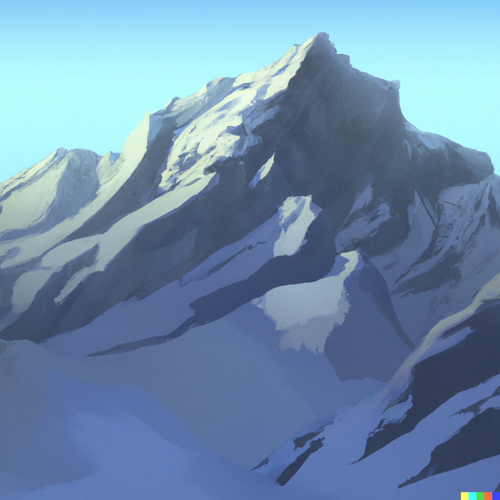

This is some text before a section. It shouldn't be indented. Each section should start on a new page (but subsections shouldn't).

# This is a section

This is some test text. This is formatted in *italics* and **bold**, with - various -- dashes---, and trailing dots...

'These quotes should be curly,' and "so should these." There should be a blank line before the next paragraph:

&nbsp;

And then there should be some text ^in\ superscript^ and ~in\ subscript~, and a footnote^[This is a footnote. It should appear at the bottom of the page.] with a star, a footnote^[Another footnote.] with a dagger, and this should be `monospace`.

## Subsection

Test text test text test text.

> This is a quote block. It should be indented slightly
> and shouldn't contain a line break.

> | This is a quoted line block. It should be indented slightly
> | and have a *line break* after 'slightly', and **formatting**.

> | \“These literal double curly quotes, used where smart
> | quotes gets it wrong, curl the right way even though
> | they're on different lines.\”

> | \‘These literal single curly quotes, used where smart
> | quotes gets it wrong, curl the right way even though
> | they're on different lines.\’

After this line there should be stars.

* * *

This is a new paragraph after the stars. This text is [Small Caps]{.smallcaps}. Here is a pound sign (£), a euro sign (€), and three letters with accents: ëóû.

# This is a second section

{width=50%}

There is an image here.

And this is *even more italic text*.
